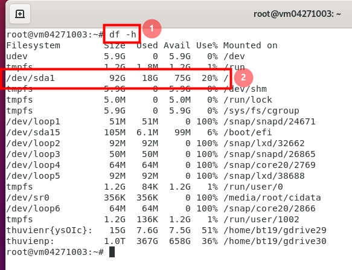
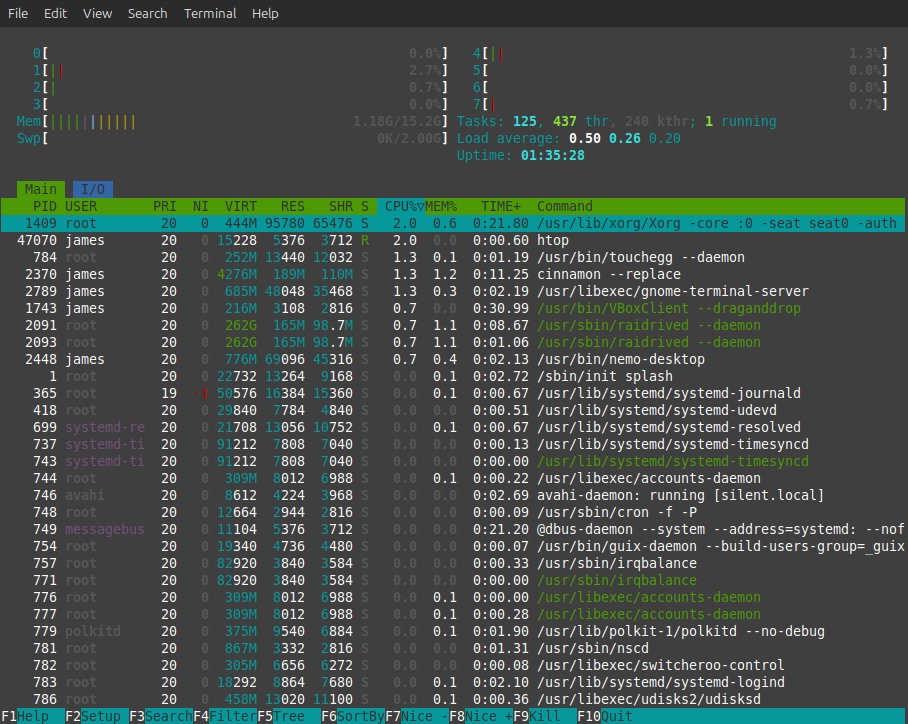

[Các lệnh kiểm tra hệ thống, lệnh cơ bản, tạo thư mục, phân quyền user.]{style="color:blue"}

# Các lệnh kiểm tra Linux verion

```{bash, eval = F}
james@silent:~$ hostnamectl
```

```{bash, eval=F}
#| code-line-numbers: true

 Static hostname: silent
       Icon name: computer-vm
         Chassis: vm 🖴
      Machine ID:
         Boot ID:
  Virtualization: oracle
Operating System: Linux Mint 22
          Kernel: Linux 6.8.0-60-generic
    Architecture: x86-64
 Hardware Vendor: innotek GmbH
  Hardware Model: VirtualBox
Firmware Version: VirtualBox
   Firmware Date: Fri 2006-12-01
    Firmware Age: 19y 1month 1d
```

```{bash, eval=F}
james@silent:~$ lsb_release -a
```

```{bash, eval=F}
#| code-line-numbers: true

No LSB modules are available.
Distributor ID:	Linuxmint
Description:	Linux Mint 22
Release:	22
Codename:	wilma
```

* <https://www.hivelocity.net/kb/check-linux-version/>

# Khởi động lại Linux

```{bash, eval=F}
sudo reboot
```

# Các lệnh kiểm tra directory

```{bash, eval=F}
# change directory
cd

# go back one level

cd ..

# working directory hiện tại
pwd 

# liệt kê file
ls
```

# Các lệnh kiểm tra dung lượng ổ cứng

```{bash, eval=F}
df -h
```




# Các lệnh kiểm tra hệ thống

```{bash, eval=F}
# gọi câu lệnh htop, nếu máy chưa cài đặt thì cài package này
sudo apt install htop
```

```{bash, eval=F}
james@silent:~$ htop
```

Bằng cách này ta có thể sort xem process nào chiếm nhiều RAM hay CPU để có hướng xử lý.



```{bash, eval = F}
james@silent:~$ uptime
 14:32:35 up  1:40,  1 user,  load average: 0,00, 0,10, 0,14

```

Một số câu lệnh khác

```{bash, eval = F}
# you can use top or ps commands to check the CPU usage.
top

LC_ALL=C top -b -n 1 |grep ^%Cpu

# using ps: This will show you the % cpu usage for each process.
ps -eo pcpu,pid,user,args | sort -r -k1 | less

cat /proc/stat


```

Khi đang trong terminal, muốn thoát ra, ta gõ `q` sau đó `Enter`.

* <https://123host.vn/tailieu/kb/vps/su-dung-htop-de-kiem-tra-tai-nguyen-thong-linux.html>

* <https://www.cyberciti.biz/tips/how-do-i-find-out-linux-cpu-utilization.html>

* <http://www.mail-archive.com/linuxkernelnewbies@googlegroups.com/msg01690.html>

# Các lệnh update package

* <https://linuxize.com/post/how-to-use-apt-command/>

# Các lệnh uninstall package

Đầu tiên để `remove` một phần mềm nào đó trong Linux (ta gọi là `package`), thì ta cần xem phần mềm đó có đang chạy hay không. Ví dụ ta đang cài `raidrive` (phần mềm mount ổ cloud như ổ cứng trên máy tính), chạy dòng lệnh sau

<https://docs.raidrive.com/en/cli/commands/status/>

```{bash, eval = F}
raidrivecli status # lệnh này trả về kết quả xem raidrive có đang running không
```

Sau đó ta liệt kê các phần mềm đang chạy trên máy, rồi gỡ cài đặt, xem chi tiết ở đây

<https://www.cyberciti.biz/faq/linux-uninstall-package-software-using-the-cli/>

```{bash, eval = F}
apt list --installed

dpkg --list

dpkg --list | grep '^ii'

dpkg --list | grep -i 'raidrive' # kiểm tra xem có package nào tên là raidrive

sudo apt remove raidrive
```


# Nguồn học Linux

<https://www.server-world.info/en/>

<https://academy.hackthebox.com/course/preview/linux-fundamentals>

<https://labex.io/linuxjourney>


