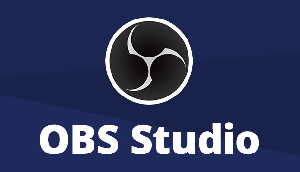
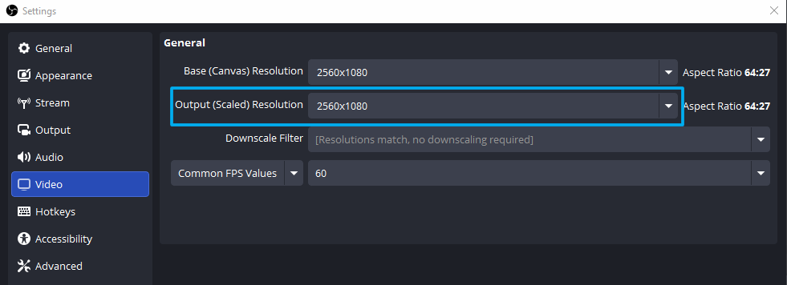
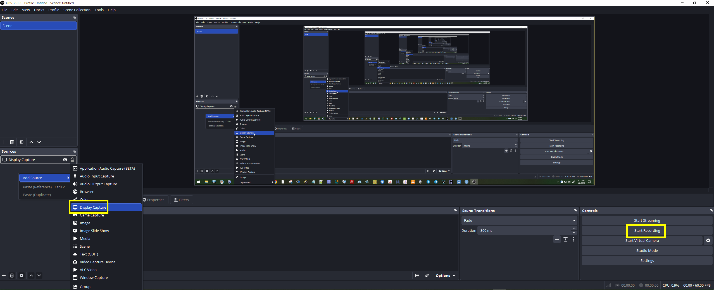

Cách sử dụng OBS Studio để ghi màn hình.

{width=50%}

Cách sử dụng trên Windows:

<https://youtu.be/j1HIHYRnOfo?si=pqdoUw0evQ7TnBry>

Cách sử dụng trên MacOS:

<https://www.youtube.com/watch?v=V70gziBFxzM>

Lưu ý:

* Set output scale để ghi màn hình full độ phân giải

* Add source sau đó ghi âm màn hình, test thử bằng cách quay lại video youtube xem có ghi được âm thanh không.

